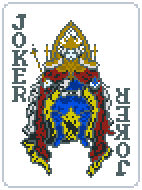

# Balatro_HighCardMod
A Balatro mod that introduces X-Play Mechanics to the game along with 1 deck and 52+ X-Playing Cards. The mod is a reference to the anime series "High Card", with joker art and mechanics dedicated to connecting the two popular works on poker cards. 

  

# Installation
1. Please install [Steamodded](https://github.com/Steamopollys/Steamodded) via its instructions. This is used by most of the Balatro mods.

Quick Install for step 2 and 3: download the two zip files and unzip them in Steamodded's Mods folder. You should get two folders: `CardBackInjection` and `HighCardMod`;

2. Please install [CardBackInjection](https://github.com/Ken-Shi/Balatro_CardBackInjection), which is another mod I made that allows addition of custom card backs to the game. TL;DR: get the `CardBackInjection` folder in Steamodded's Mods folder.
3. Install HighCardMod simply by download `HighCardMod` folder put them in Steamodded's Mods folder.
4. Enjoy your journey as a **PLAYER**!

# X-Playing Deck and X-Playing Joker

Once you install the mod, you will see a new deck called *X-Playing Deck*, this deck will have all 52 regular poker cards and a legendary joker at the beginning of the run:

This joker will **transform** into a X-Playing Card joker once you play your first hand of the round. Whichever hand you played, it will transfer (the corresponding High Card or X-Hand). 

At the end of the round, it will transform back to X-Playing Joker so you can decide to **PLAY** something else next round! 

# Currently Supported X-Playing Cards

You can discover their amazing abilities in collection tab once you install the mod! More X-Playing Cards and X-hands are WIP! 

Feel free to reach out in the modding chat of [Balatro official discord](https://discord.com/invite/balatro)! 

My IGN is **Kenny Stone**, any feedback is welcomed! 
