# Balatro High Card Mod
A Balatro mod that introduces X-Play Mechanics to the game along with 1 deck and 52+ X-Playing Cards. 

[Official Website](https://www.balatrohighcardmod.com/) is now available! 

The mod takes inspiration from the anime series "High Card", with joker art and mechanics dedicated to connecting the two popular works on poker cards. 

  

# Installation
1. Please install [Steamodded](https://github.com/Steamopollys/Steamodded) via its instructions (Currently support 0.9.7+). This is used by most of the Balatro mods.
   
Quick Install for step 2: download the zip file and unzip them in Steamodded's Mods folder. You should get a folders called `HighCardMod`;

2. Install HighCardMod simply by download `HighCardMod` folder put them in Steamodded's Mods folder.

3. Enjoy your journey as a **PLAYER**!

**Note: There is a major rework of the mod released on April 8, 2024. If you have played a version prior to this date, I recommend a refresh install!** 

# X-Playing Deck and X-Playing Joker

Once you install the mod, you will see a new deck called *X-Playing Deck*, this deck will have all 52 regular poker cards and a legendary joker at the beginning of the run:

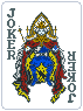

This joker will **transform** into a X-Playing Card joker once you play your first hand of the round. Whichever hand you played, it will transfer (the corresponding High Card or X-Hand). 

At the end of the round, it will transform back to X-Playing Joker so you can decide to **PLAY** something else next round! 

# Currently Supported X-Playing Cards (42 / 52)

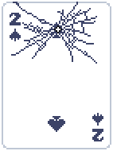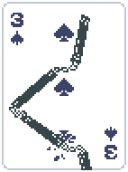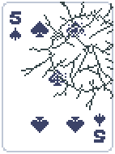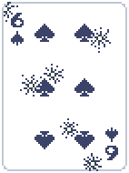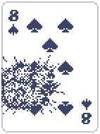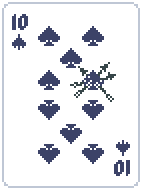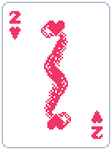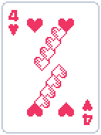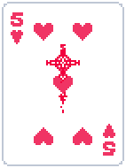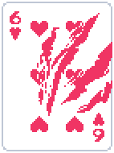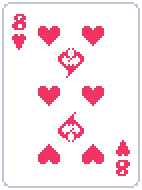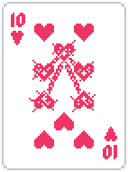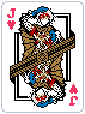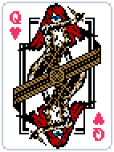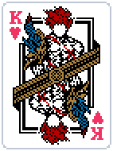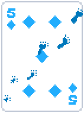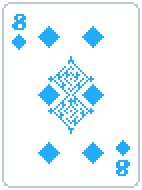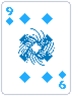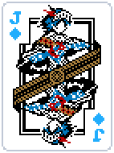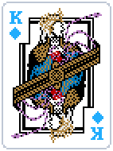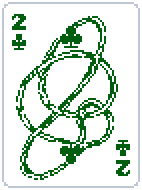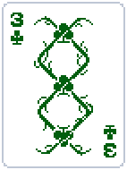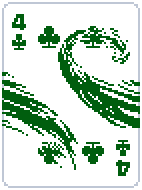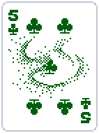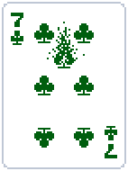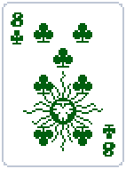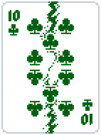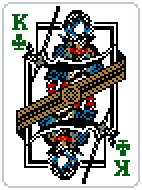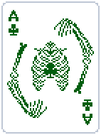

You can discover their amazing abilities in collection tab once you install the mod or on the mod website [here](https://www.balatrohighcardmod.com/)! More X-Playing Cards and X-hands are WIP! 

Feel free to reach out in the modding chat of [Balatro official discord](https://discord.com/invite/balatro)! 

My IGN is **Kenny Stone**, any feedback is welcomed! 
